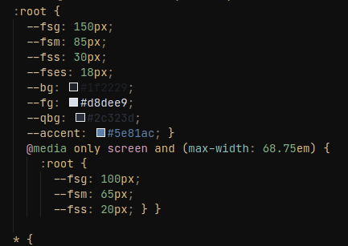
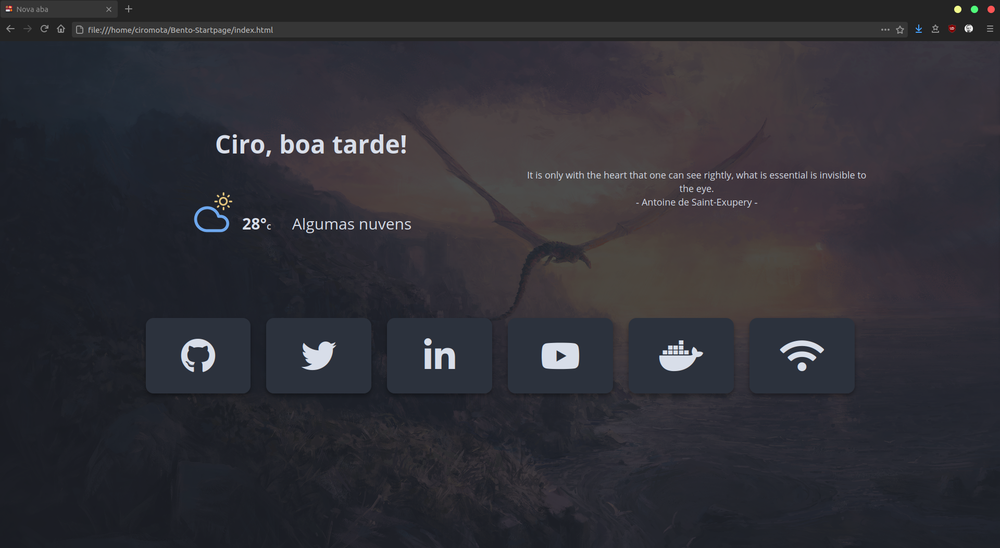

<h1>Fork - Bento: 🍱 A Clean and Simple Startpage</h1>

A Fork from [Bento of MiguelRAvila](https://github.com/MiguelRAvila/Bento) project, thank you.

### Disclaimer

The changes here in this project were made in an empirical way, based for my use. They probably have better ways to make the as I did, but it escapes my knowledge I have on the.

### Modifications

- Change number of borkmarks blocks.
- The accent color of the buttons has been modified to match the Yaru Deepblue theme.
- Clock removed.
- Translate Greetings for Portuguese Brazil.
- Swap of Unpkg icons for Font Awesome.
- Quote messages API from [forismatic](http://forismatic.com/en/api/) [code](https://codepen.io/catapixel/pen/LpVEgy).
- Usage the Reddit API for random background wallpapers. Small copy of the [Wittmannen homepage-v1](https://github.com/Wittmannen/homepage-v1) project.
- Removing parts of the code not used by me.

### Usage

#### As Home Page:
1. Fork this repo.
2. Enable the Github Pages service `Settings > GitHub Pages > Source [master branch] > Save`.
3. Set it as Home Page:
    - Click the menu button. and select Options. Preferences.
    - Click the Home panel.
    - Click the menu next to Homepage and new windows and choose to show custom URLs and add your `Github Pages link`.
    - Or `git clone` and use locally `index.html` file.

#### As New Tab:
1. You can use different Add-ons/Extensions for it
  - If you use Firefox: [Custom New Tab Page](https://addons.mozilla.org/en-US/firefox/addon/custom-new-tab-page/?src=search).
  - If you use Chromium (Brave, Vivaldi, Chrome): [Custom New Tab URL](https://chrome.google.com/webstore/detail/custom-new-tab-url/mmjbdbjnoablegbkcklggeknkfcjkjia).

### Customization

#### Colors:
In the CSS code you can always change the variables colors:

#### Weather:

In line 16 of the `weather.js` file, insert your API from OpenWeatherMap.   
In line 24 and 25 of the `weather.js`, change your cordinate location.

#### Greetings:

In line 5 until 9 of the `greeting.js` translate messages for your language.

### Final appearance 

